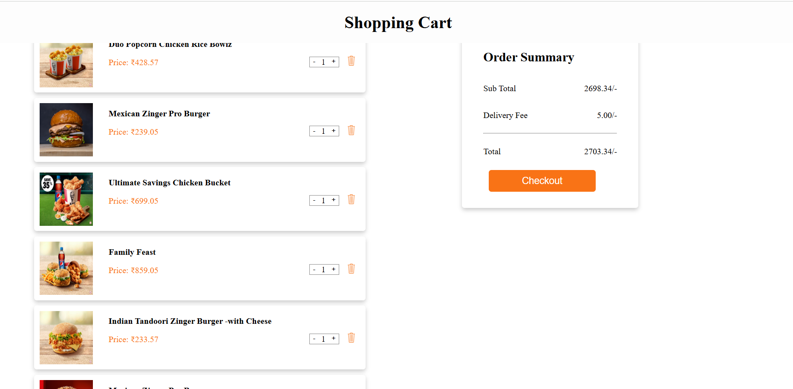

# Tasty-Trail
**Tasty** Trail is an interactive and visually appealing web application designed to explore recipes, food categories, and culinary delights. It provides users with an engaging experience to navigate through diverse cuisines and find inspiration for their next meal. The application is built using modern web technologies for seamless performance and responsiveness.

# 🌐 Live Demo
Check out the live version of the project here: [Tasty Trail](https://gangahasan.github.io/Tasty-Trail/)

# 🛠️Features
## 🚀 Intuitive & User-Friendly Interface:

  A clean, modern, and visually appealing design ensures a seamless browsing experience for users. The well-structured layout makes navigation smooth and hassle-      free.
  

## 🔐 User Sign-Up/Login Form:

  A well-structured sign-up and login form allows users to quickly enter their details and proceed with their orders. The intuitive design ensures a smooth and         hassle-free experience.
  

## 🍽️ Explore a Dynamic Menu:

  Discover a variety of delicious recipes across multiple categories. The interactive menu lets users filter, search, and explore dishes effortlessly.
  

## 🛍️Interactive Shopping Cart:

  Users can add recipes or ingredients to their cart, modify quantities, and proceed to checkout smoothly. The cart dynamically updates based on user actions.
  

## 💳 Seamless Checkout Process:

  A streamlined checkout experience ensures quick and secure order placement. Users can review their orders and complete transactions with ease.
  

## 🎉 Order Confirmation & Success Page:

  Once the order is placed successfully, users are greeted with a confirmation message, enhancing their experience with a professional and engaging touch.

  
  
## ✨ Why Choose Tasty-Trail?

✅ Responsive & Mobile-Friendly – Works flawlessly across all devices.
✅ Fast & Efficient – Optimized for performance and quick load times.
✅ Engaging UI/UX – Designed for a smooth and interactive user experience.

# 📑Technologies Used
**Frontend:**

* HTML

* CSS

* JavaScript

**Hosting:** GitHub Pages

# 🚀 How to Use

* Open the live demo link: [Tasty Trail](https://gangahasan.github.io/Tasty-Trail/).(Open this in a new tab)

* Browse through the different food categories and recipes.

* Click on any recipe or category to explore further details.

* Enjoy discovering new dishes!

# 🛠️ How to Run Locally

* **Clone the repository:** git clone https://github.com/GangaHasan/Tasty-Trail.git

* **Navigate to the project directory:** **`cd`** Tasty-Trail

* Open the **`index.html`** file in your preferred web browser.

# 📧Contact

If you have any  feedback, or suggestions, feel free to reach out:

* **Author:** Ganga Bhavani Vantaku

* **GitHub:** GangaHasan

* **Email:** rgangabhavani2@gmail.com

# 🌟Acknowledgments

Special thanks to all who supported and inspired this project. 
Your encouragement has been invaluable!

